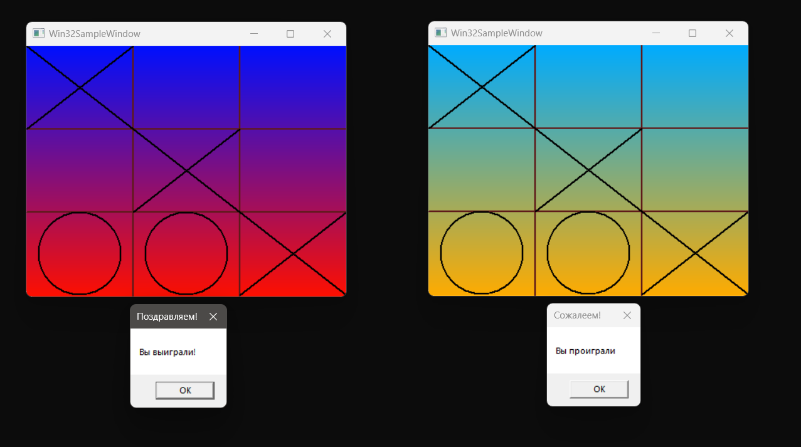

# Cross-nulls

Данный проект - это реализация игры крестики-нолики с использованием чистого WinAPI. Приложение написано в рамках лаборатной работы по предмету "Операционные системы". Приложение синхронизирует отображение игрового поля между несколькими своими экземплярами и переносит отрисовку поля в отдельный поток.

## Использование
1. [Скачайте данный репозиторий](https://github.com/Lagertt/Cross-nulls/archive/refs/heads/main.zip)
2. Запустите файл CrossNuls.exe (это будет первый пользователь)
3. Повторно запустите файл CrossNuls.exe (это второй пользователь)
4. Для смены цвета сетки используйте колесо мыши
5. Для остановки/запуска движений градиента на фоне нажмите пробел
6. В файле config.txt вы можете менять такие параметры, как:
    - Размер поля (N)
    - Размер окна (ширина и высота)
    - Цвет фона и цвет линий сетки 
7. Реализована возможность устанавливать приоритет потока отрисовки путем нажатия цифровых клавиш (например, 1 для установки фонового приоритета, 2 - низшего
и т.д.). Но данную функцию можно зрительно увидеть лишь при намеренном ограничении ресурсов процессора, либо на ооочень слабых ПК :)
